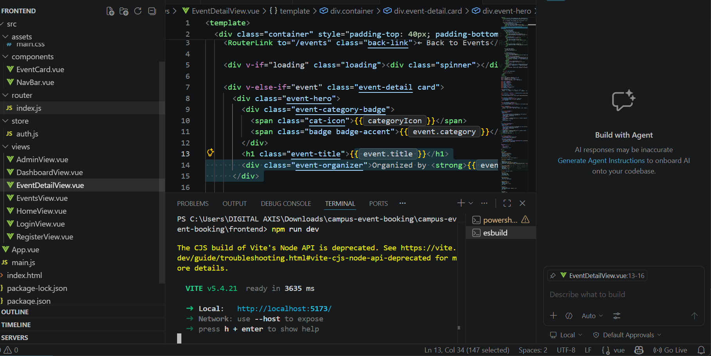
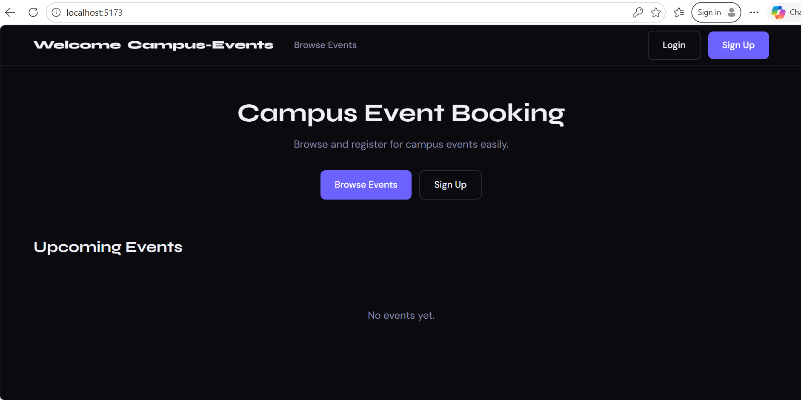
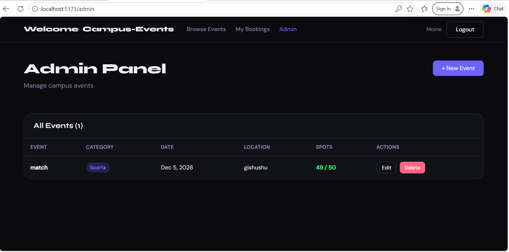
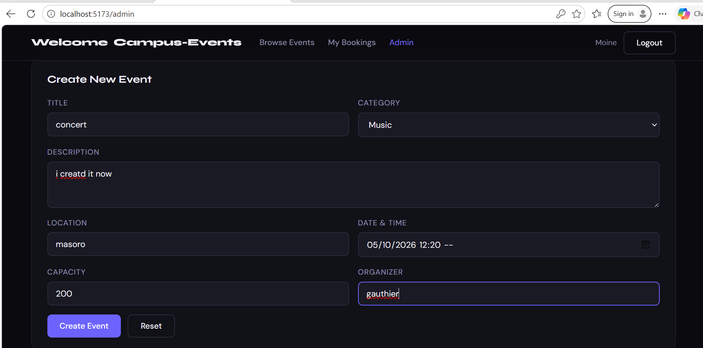
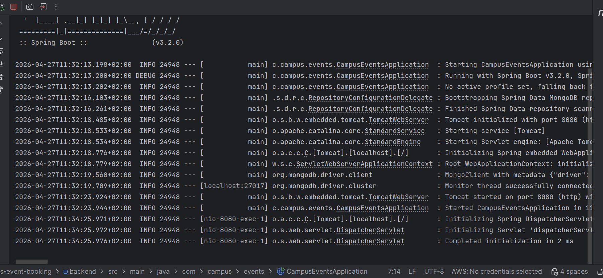
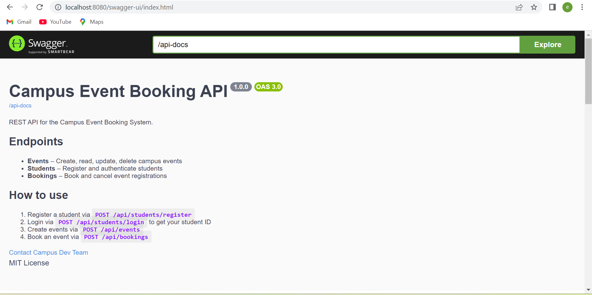
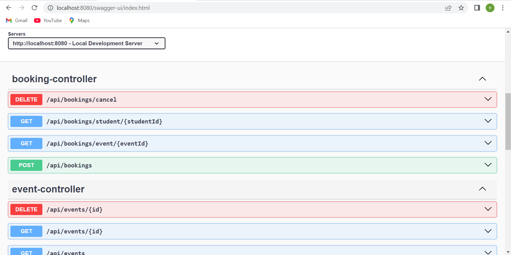
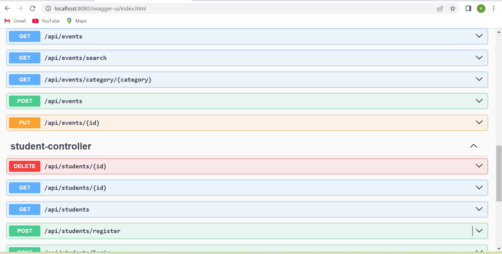
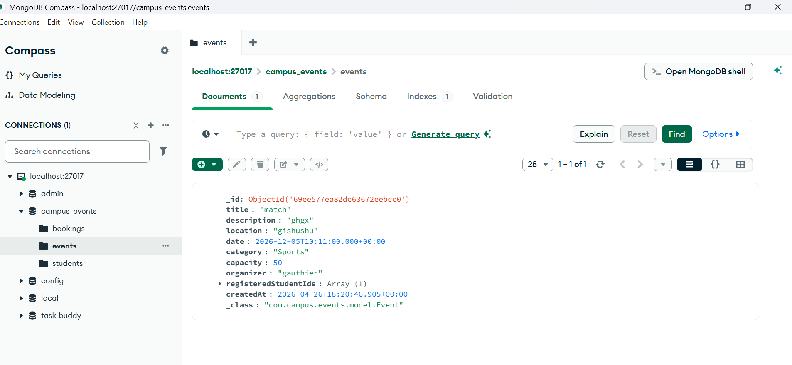

# 🎓 Campus Event Booking System

A full-stack MVC web application built with **Spring Boot** (backend) + **Vue.js** (frontend) + **MongoDB** (database).

---

##  Project Structure

```
campus-event-booking/
├── backend/          ← Spring Boot (IntelliJ)
│   ├── pom.xml
│   └── src/main/java/com/campus/events/
│       ├── model/          (Event, Student, Booking)
│       ├── repository/     (MongoRepository interfaces)
│       ├── service/        (Business logic)
│       └── controller/     (REST API endpoints)
│
└── frontend/         ← Vue.js (VS Code)
    ├── package.json
    ├── vite.config.js
    └── src/
        ├── api/            (Axios API calls)
        ├── store/          (Pinia auth store)
        ├── router/         (Vue Router)
        ├── views/          (Pages)
        └── components/     (Reusable components)
```

---

##  Setup Instructions

### 1. MongoDB
Make sure MongoDB is running locally:
```bash
mongod
```
The app uses database: `campus_events` on port `27017` (auto-created).

---

### 2. Backend (IntelliJ IDEA)

1. Open the `backend/` folder in IntelliJ
2. Wait for Maven to download dependencies
3. Run `CampusEventsApplication.java`
4. API will be live at: `http://localhost:8080`

> **Note:** Lombok plugin must be installed in IntelliJ. Go to:
> `Settings → Plugins → Search "Lombok" → Install → Enable annotation processing`

---

### 3. Frontend (VS Code)

1. Open the `frontend/` folder in VS Code
2. Install dependencies:
```bash
npm install
```
3. Start dev server:
```bash
npm run dev
```
4. Open: `http://localhost:5173`

---

## REST API Endpoints

### Events
| Method | Endpoint | Description |
|--------|----------|-------------|
| GET | `/api/events` | Get all events |
| GET | `/api/events/:id` | Get event by ID |
| GET | `/api/events/category/:cat` | Filter by category |
| GET | `/api/events/search?q=` | Search events |
| POST | `/api/events` | Create event |
| PUT | `/api/events/:id` | Update event |
| DELETE | `/api/events/:id` | Delete event |

### Students
| Method | Endpoint | Description |
|--------|----------|-------------|
| POST | `/api/students/register` | Register student |
| POST | `/api/students/login` | Login |
| GET | `/api/students/:id` | Get student |

### Bookings
| Method | Endpoint | Description |
|--------|----------|-------------|
| POST | `/api/bookings` | Book an event |
| DELETE | `/api/bookings/cancel` | Cancel booking |
| GET | `/api/bookings/student/:id` | Get student bookings |
| GET | `/api/bookings/event/:id` | Get event bookings |

---

##  MVC Architecture

```
Vue.js (View)
    ↕ HTTP/Axios
Spring Boot Controller (Controller)
    ↕
Spring Service (Business Logic)
    ↕
MongoDB Repository (Model/Data)
    ↕
MongoDB Database
```

---

##  Features

- ✅ Student registration & login
- ✅ Browse all events with search & category filter
- ✅ Event detail page with booking
- ✅ Cancel registrations
- ✅ Student dashboard showing bookings
- ✅ Admin panel to create/edit/delete events
- ✅ Real-time spot availability tracking
- ✅ CORS configured between frontend & backend

---

##  screenshoots

## Frontend





## backend





## DATA

